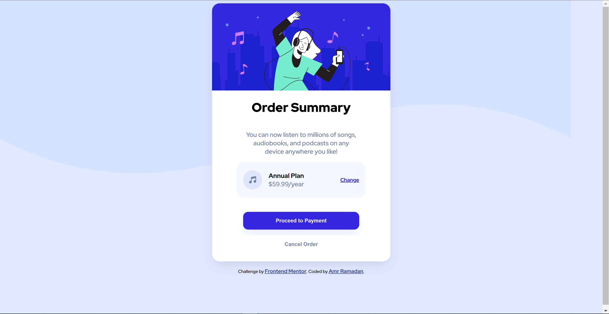

# Frontend Mentor - Order summary card solution

This is a solution to the [Order summary card challenge on Frontend Mentor](https://www.frontendmentor.io/challenges/order-summary-component-QlPmajDUj). Frontend Mentor challenges help you improve your coding skills by building realistic projects. 

## Table of contents

- [Frontend Mentor - Order summary card solution](#frontend-mentor---order-summary-card-solution)
  - [Table of contents](#table-of-contents)
  - [Overview](#overview)
    - [The challenge](#the-challenge)
    - [Screenshot](#screenshot)
    - [Links](#links)
  - [My process](#my-process)
    - [Built with](#built-with)
    - [What I learned](#what-i-learned)
    - [Continued development](#continued-development)
    - [Useful resources](#useful-resources)
  - [Author](#author)

## Overview

### The challenge

Users should be able to:

- See hover states for interactive elements

### Screenshot

### Links

- Solution URL: [Add solution URL here](https://github.com/amramadan/OrderSummaryCard)
- Live Site URL: [Add live site URL here](codesandbox.io/s/github/amramadan/ordersummarycard)

## My process

### Built with

- Semantic HTML5 markup
- CSS custom properties
- Flexbox
- Mobile-first workflow

### What I learned

This is my first attempt to create a responsive development. I learned more about flexbox.

### Continued development

I plan on returning to this card and adding a description on the back so when you click a "flip-button" you can flip it read further details (maybe terms and conditions).

### Useful resources

- [A Complete guide to flexbox](https://css-tricks.com/snippets/css/a-guide-to-flexbox/) - This helped me with flexbox alignments (self and items).
  
## Author

- Website (for now its just github) - [Amr Ramadan](https://github.com/amramadan/)
- Frontend Mentor - [@amramadan](https://www.frontendmentor.io/profile/amramadan)

